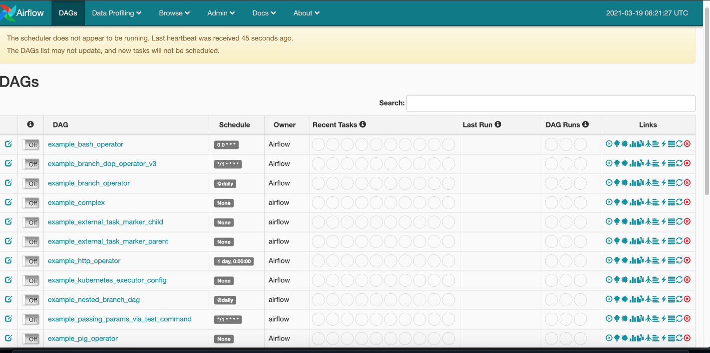

# airflow docker base setup

 

##  install airflow 
```shell script
# cli command 
 git clone repo
# 

```

> docker run -it --rm -p 8080:8080 python:3.8-slim /bin/bash
- 도커 컨테이너를 시작한다. 

> python -V 
- 파이썬 버전 확인 

> export AIRFLOW_HOME=/usr/local/airflow
- airflow 환경 변수 설정 
 
> env | grep airflow 
- 환경 변수 설정이 맞게 되었는지 확인 

> apt-get update -y && apt-get install -y  wget libczmq-dev curl libssl-dev git inetutils-telnet bind9utils freetds-dev libkrb5-dev libsasl2-dev libffi-dev libpq-dev freetds-bin build-essential default-libmysqlclient-dev apt-utils rsync zip unzip gcc && apt-get clean
- 온갖 툴 설치 

> useradd -ms /bin/bash -d ${AIRFLOW_HOME} airflow
- airflow user 추가 

> cat /etc/passwd | grep airflow
- airflow user가 만들어졌는지 체크 
```shell script
# 요런 리스폰스를 받아야 함
airflow:x:1000:1000::/usr/local/airflow:/bin/bash
```

> pip install --upgrade pip
- upgrade pip 

> su - airflow 
- airflow 유저로 로그인 

> python -m venv ./sandbox
- 파이썬 가상환경 설정 

> source .sandbox/bin/activate

> wget https://raw.githubusercontent.com/apache/airflow/constraints-1.10.12/constraints-3.8.txt -O requirements-python3.8.txt
- requirements.txt file 다운로드 

> pip install apache-airflow[crypto,celery,postgres,kubernetes,docker]==1.10.12 --constraint ./requirements-python3.8.txt
- requirements.txt에 적용되는 라이브러리와 airflow dependency 설치 

> airflow initdb
- metadatabase 초기화

> airflow scheduler & 

> airflow webserver & 

- start airflow in the background 


webserver ui


